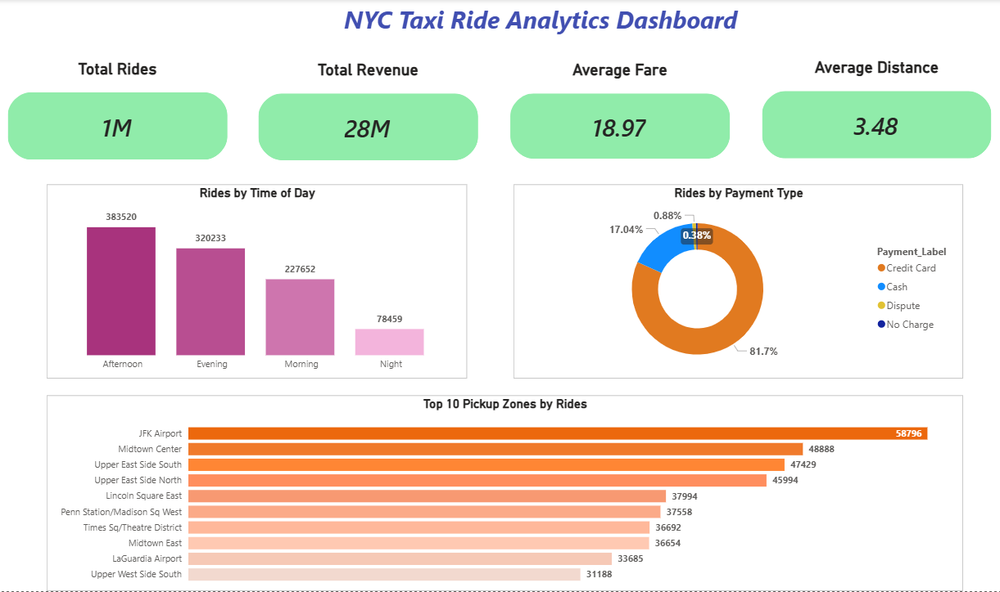

# NYC Taxi Ride Analytics Dashboard

## Overview
This project is an interactive Power BI dashboard built to analyze NYC taxi ride data. It provides insights into ride patterns, revenue trends, customer behavior, and operational performance. The goal is to understand how taxi services are used and identify key trends such as peak demand hours, popular pickup locations, and payment preferences.

## Tools Used
- Power BI
- Excel / CSV dataset
- DAX (Data Analysis Expressions)
- Data cleaning and transformation

## Process
- Collected and prepared NYC taxi ride dataset
- Cleaned and transformed data for analysis
- Created calculated measures using DAX
- Built interactive visualizations in Power BI dashboard

## Key Insights
- Peak ride demand is highest in the afternoon
- Around 81% of payments are made using credit card, making it the most preferred payment method
- JFK Airport is the top pickup zone by number of rides

## Dashboard
